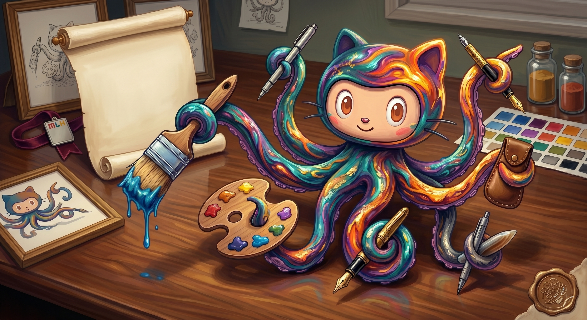

# 🎨 MLH GitHub Octocat Drawing Contest Entry

Welcome to my official submission for the Major League Hacking (MLH) Global Hack Week Octocat Drawing Challenge!

## 🤖 The Design: The Architect Octocat

### Description
Meet **The Architect Octocat**. This design goes beyond the frontend to celebrate the complex logic powering our modern digital world. Inspired by the intricacies of backend software engineering, data structures, and building secure, scalable systems, this Octocat represents the unseen art of coding. 

Just as an architect masterfully coordinates raw building blocks into a functional marvel, this Octocat controls the chaotic but beautiful threads of a version control commit graph—weaving Python, Java, and complex algorithms into a seamless, unified digital canvas.

## 🛠️ Tools Used
* Generative AI (Gemini)
* Prompt Engineering & Digital Art Direction
